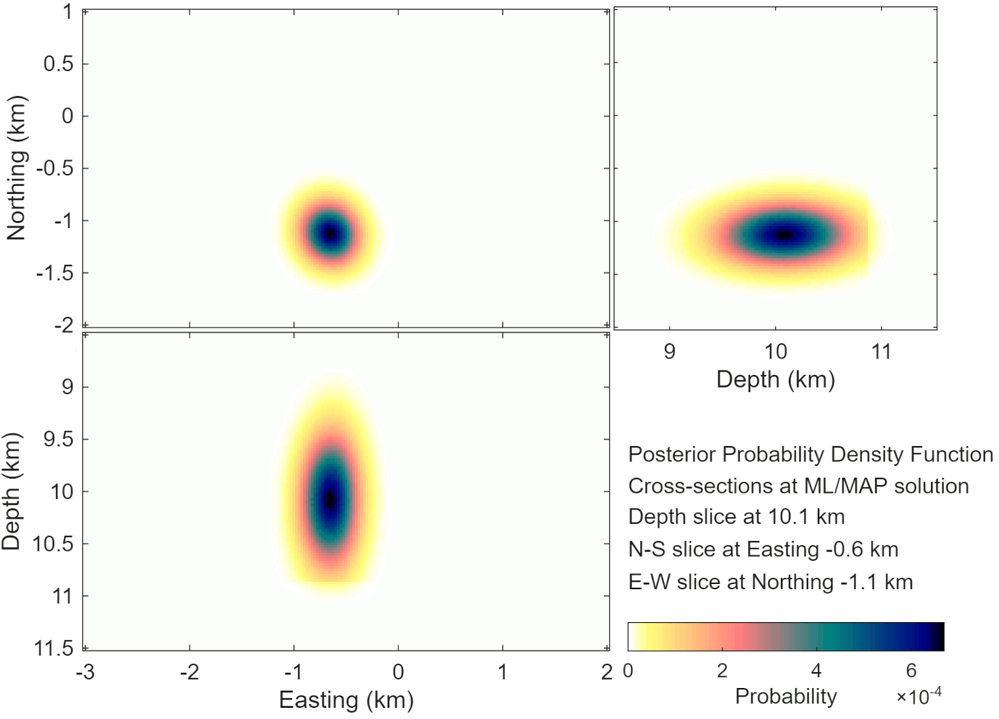

# Parallel Bayesian earthquake hypocenter location from wave arrival times

Robust 3D Bayesian hypocenter localization from body P- and S-wave arrival times in a layered 1D medium including full Uncertainty Quantification.

<a href="#cite"></a>
[](https://doi.org/10.1186/s40623-019-1016-8)
[](https://doi.org/10.5281/zenodo.19343031)


-%230076B4?style=flat)

---

This tool provides a robust framework for 3D earthquake hypocenter localization 
and rigorous Uncertainty Quantification (UQ) in 1D layered media. It utilizes body P- and 
S-wave arrival times to assess hypocenter locations through a high-performance, parallelized, 
and scalable 3D grid search. Another key feature of the implementation is the estimation of arrival 
time uncertainties via Monte Carlo simulations and ray tracing within randomly perturbed 
velocity models. Following the probabilistic inverse theory of Tarantola (2005), these 
uncertainties are rigorously evaluated within a Bayesian framework to determine the 
final posterior Probability Density Function (PDF). This approach ensures that the 
solution provides not only the most likely coordinates but also an assessment of the 
location uncertainty, making it an ideal tool for both seismic research and industrial 
applications.

## 1 METHODOLOGY

The suite uses theory by Tarantola (2005) in the implementation by Hallo et al. (2019).

  Tarantola, A. (2005, Chapter 7.1). Inverse Problem Theory and Methods 
for Model Parameter Estimation, Society for Industrial and Applied 
Mathematics, Philadelphia, USA.

  Hallo, M., Oprsal, I., Asano, K., Gallovic, F. (2019). Seismotectonics
of the 2018 Northern Osaka M6.1 earthquake and its aftershocks: joint
movements on strike-slip and reverse faults in inland Japan. Earth,
Planets and Space, 71:34. [https://doi.org/10.1186/s40623-019-1016-8](https://doi.org/10.1186/s40623-019-1016-8)

## 2 TECHNICAL IMPLEMENTATION

* **Parallel Computing:** Scalable Parallel Grid Search Engine (MATLAB Parallel Computing Toolbox)
* **Algorithm:** 3D Bayesian Inference, Ray Tracing (1D), Monte Carlo simulations
* **Analysis:** Rigorous Uncertainty Quantification (UQ), Full Posterior PDF Estimation
* **Compatibility:** Cross-Platform (Windows, Linux, macOS), Universal Serial/Parallel execution (scalable)

The official software version is archived on Zenodo:

[](https://doi.org/10.5281/zenodo.19343031)

## 3 PACKAGE CONTENT

1. `run1_pert_model.m` - Perform Monte Carlo simulations to get uncertainties of P and S-wave arrival times
2. `run2_hypo_loc.m` - Evaluate the posterior probability density function (PDF) and the location of the hypocenter
3. `example_crustal.dat` - Example of input 1D velocity model of Earth's crust
4. `example_loc.txt` - Example of input text file with P and S-wave arrival time data
5. `example_pert_model_uncertainty.txt` - Example of input text file with arrival time uncertainties (generated by `run1_pert_model.m` by Monte Carlo simulations)

## 4 RELEASE HISTORY (MAJOR VERSIONS)

*   **2.1 — Parallelized & Refactored Engine** | April 2026
    *   Scalable Parallel Engine: Parallelized PDF calculations using `parfor` from the Parallel Computing Toolbox (the code automatically scales to available CPU cores/threads)
    *   Adaptive Execution: Runs in high-performance **Parallel Mode** if available, or falls back to **Serial Mode**
    *   Processing Pipeline: Streamlined workflow into two core scripts for automated data flow
    *   Numerical Engine: Enhanced PDF stability and added Posterior Mean (PM) estimator (alongside ML/MAP)
    *   Modernization: Fully ported to MATLAB R2025b with industry-standard directory structure
    *   UX/I-O: Robust ASCII parser, refined graphical reports, and real-time progress & ETA tracking even during heavy parallel workloads

*   **1.0 — Initial Release** | December 2018
    *   Core implementation used by paper published in Earth, Planets and Space (Hallo et al., 2019)

## 5 REQUIREMENTS
  
  MATLAB: Version R2025b or newer
  
  Serial execution: Codes do not require any additional Matlab Toolboxes
  
  Parallel execution (Optional): Parallel Computing Toolbox (automatically scales to available CPU cores/threads)

## 6 USAGE

1. Prepare your 1D velocity model in `example_crustal.dat` (Note: Input schema includes Rho, Qp, and Qs for compatibility with standard velocity models; however, this implementation operates exclusively on Vp and Vs)
2. Prepare your P and S-wave arrival time data in `example_loc.txt`
3. Open MATLAB
4. Run the script `run1_pert_model.m` to generate arrival time uncertainties for your velocity model
5. Set up and run the script `run2_hypo_loc.m` to evaluate the location of the hypocenter
6. Check `/results` folder for high-resolution figures and text file with results

## 7 EXAMPLE OUTPUT

The computation process is monitored, and the tool informs the user in real-time about the progress and an Estimated Time of Arrival (ETA) even during heavy parallel workloads. See the example below:
```text
Parallel Mode (12 workers)
Processing  13% (ETA: 00:05:08)
```

Regarding the results, the figure below illustrates the output 3D posterior Probability Density Function (PDF) with orthogonal slices (Depth, N-S, E-W) passing through the Maximum Likelihood (ML) hypocenter location. 

<picture>
  <source media="(prefers-color-scheme: dark)" srcset="img/loc_dark.png">
  <source media="(prefers-color-scheme: light)" srcset="img/loc_light.png">
  
</picture>

The tool saves results into a structured text file. It contains precise coordinates for the Maximum 
Likelihood (ML) or Maximum A Posteriori (MAP) solutions (which are identical in this case), including standard 
deviations (1σ) and double standard deviations (2σ) to quantify spatial uncertainty. Additionally, the output 
includes the Posterior Mean (PM) solution, which is particularly useful for characterizing the location in cases 
of highly asymmetric posterior PDFs.
```text
# SOLUTION FOR THE EARTHQUAKE HYPOCENTER LOCATION
# --------------------------------------------------------------------
# Maximum Likelihood solution (ML) is the same as Maximum a Posteriori solution (MAP)
# Latitude, Longitude, Depth[km], Easting, Northing, E_sigma, N_sigma, Z_sigma, E_2sigma, N_2sigma, Z_2sigma [km]
  34.83412  135.61434     10.000   -0.700    -1.100    0.178    0.197    0.344     0.355     0.394     0.687
# --------------------------------------------------------------------
# Posterior Mean solution (PM)
# Latitude, Longitude, Depth[km], Easting, Northing [km]
  34.83396  135.61484     10.072   -0.654    -1.118
```

## 8 COPYRIGHT

Copyright (C) 2017-2019,2026  Miroslav Hallo

This program is published under the GNU General Public License (GNU GPL).

This program is free software: you can modify it and/or redistribute it
or any derivative version under the terms of the GNU General Public
License as published by the Free Software Foundation, either version 3
of the License, or (at your option) any later version.

This code is distributed in the hope that it will be useful, but WITHOUT
ANY WARRANTY. We would like to kindly ask you to acknowledge the authors
and don't remove their names from the code.

You should have received a copy of the GNU General Public License along
with this program. If not, see <http://www.gnu.org/licenses/>.

<a name="cite"></a>
## 9 CITE AS

If you use this tools suite, please cite both the original methodology paper (preferred) and the software version as follows:

### For the methodology and implementation:
> Hallo, M., Oprsal, I., Asano, K., Gallovic, F. (2019). Seismotectonics of the 2018 Northern Osaka M6.1 earthquake and its aftershocks: joint movements on strike-slip and reverse faults in inland Japan. Earth, Planets and Space, 71:34. [https://doi.org/10.1186/s40623-019-1016-8](https://doi.org/10.1186/s40623-019-1016-8)

### For the specific software version:
> Hallo, M. (2026). Parallel Bayesian framework for 3D earthquake hypocenter location in 1D layered media (v2.1.3) [Software]. Zenodo. [https://doi.org/10.5281/zenodo.19343031](https://doi.org/10.5281/zenodo.19343031)

